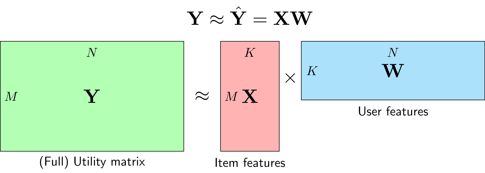

https://machinelearningcoban.com/2017/05/31/matrixfactorization/

# Giới thiệu

Collaborative Filtering dựa trên Matrix Factorization (hoặc Matrix Decomposition), tức Phân tích ma trận thành nhân tử

Trong Content-based Recommendation Systems, mỗi item được mô tả bằng một vector x được gọi là item profile. Trong phương pháp này, ta cần tìm một vector hệ số w tương ứng với mỗi user sao cho rating đã biết mà user đó cho item xấp xỉ với: y ~ wx

trong đó,
X
là ma trận của toàn bộ item profiles, mỗi hàng tương ứng với 1 item,
W
là ma trận của toàn bộ user models, mỗi cột tương ứng với 1 user.

Lưu ý:

- Tồn tại các latent features (tính chất ẩn) mô tả sự liên quan giữa các items và users. Điều này nghĩa là item mang các tính chất ẩn mà user thích, vậy thì nên gợi ý item này cho user đó.

- Matrix Factorization lại được xếp vào Collaborative Filtering vì ta phải lần lượt tìm x, w trong khi các thành phần còn lại được cố định. Như vậy, mỗi hàng của
  X
  sẽ phụ thuộc vào toàn bộ các cột của
  W
  . Ngược lại, mỗi cột của
  W
  lại phục thuộc vào toàn bộ các hàng của
  X

* Trong các bài toán thực tế, số lượng items
  M
  và số lượng users
  N
  thường rất lớn. Việc tìm ra các mô hình đơn giản giúp dự đoán ratings cần được thực hiện một cách nhanh nhất có thể.
  Neighborhood-based Collaborative Filtering không learning nhiều nhưng khi dự đoán thì cần tìm độ similarity của user đang xét với toàn bộ các users còn lại rồi suy ra kết quả. Ngược lại, với Matrix Factorization, việc learning có thể hơi phức tạp một chút vì phải lặp đi lặp lại việc tối ưu một ma trận khi cố định ma trận còn lại, nhưng việc dự đoán (inference) đơn giản hơn vì ta chỉ cần lấy tích của hai vector
  x
  w
  , mỗi vector có độ dài
  K
  là một số nhỏ hơn nhiều so với
  M
  ,
  N
  . Vậy nên quá trình inference không yêu cầu khả năng tính toán cao => phù hợp với các mô hình có tập dữ liệu lớn.

* việc lưu trữ hai ma trận
  X
  và
  W
  yêu cầu lượng bộ nhớ nhỏ khi so với việc lưu toàn bộ Similarity matrix trong Neighborhood-based Collaborative Filtering.
