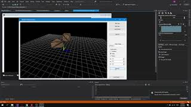

# 3D Object render using Windows Form and OpenGL

## HCMUS Computer Graphics 2020 course project

* Render CUBE, PRISM, PYRAMID

* Camera using perspective method

* Tranformation (translate, scale, rotate)

